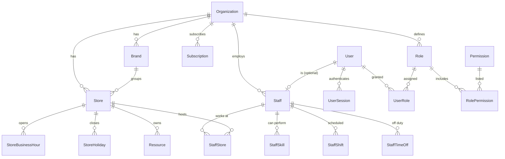
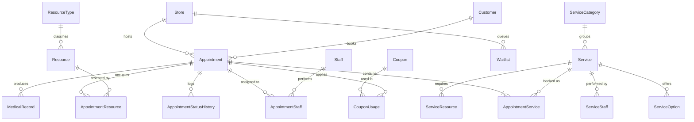
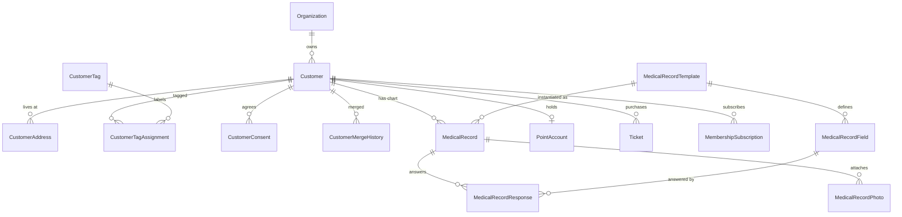
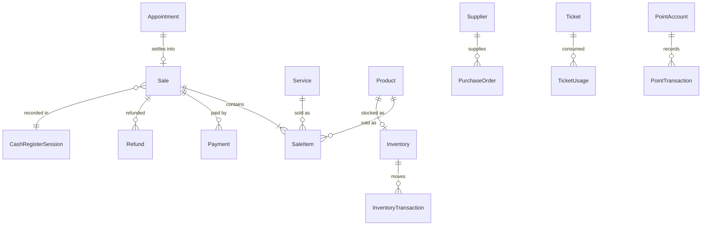
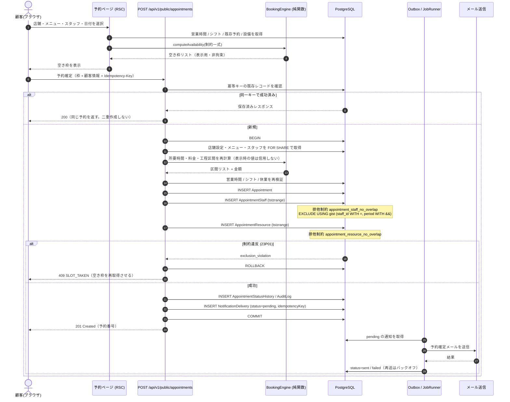
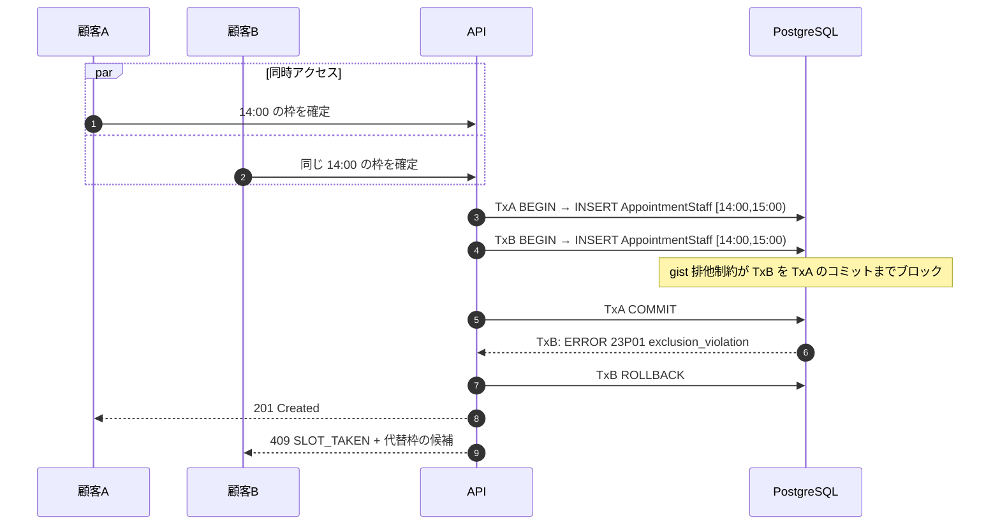
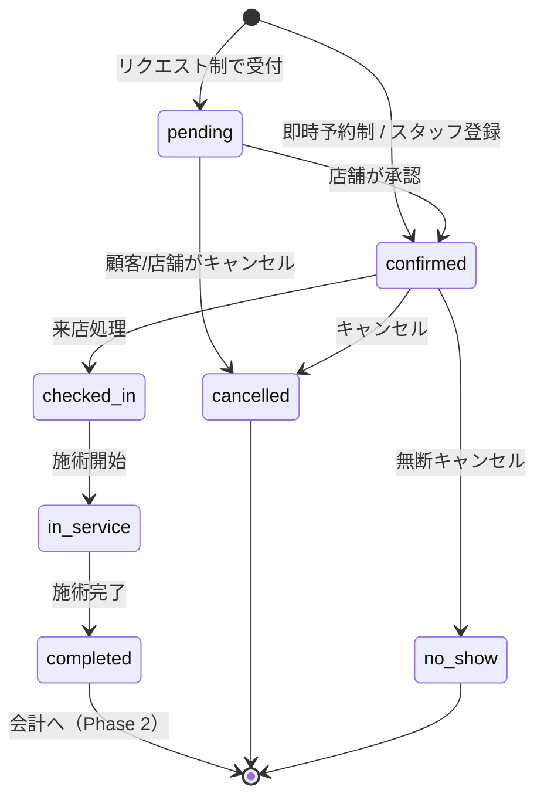

# SalonFlow — Phase 0 設計資料

本書は、サロン向け統合業務管理 SaaS「SalonFlow」（製品名は設定で変更可能）の Phase 0 成果物です。
仕様書 §26「実装時の進め方」で要求された 10 項目を、この 1 ファイルにまとめています。

- 作成日: 2026-08-03
- 対象フェーズ: Phase 0（設計） → Phase 1（MVP 実装）
- 配置先: `yakiniku-senri` リポジトリ内の `salonflow/`（独立アプリケーション）

---

## 0. 法務・知的財産上の前提（最優先）

本プロダクトは、**公開情報と一般的なサロン業務要件のみ**を基に独自設計した、機能カテゴリとして同種のサロン管理 SaaS です。

本プロジェクトでは以下を行いません。

- 特定既存サービスの名称・ロゴ・商標を製品名や画面に使用すること
- 既存サービスの画面デザイン・配色・文言・アイコン・HTML の複製
- 既存サービスの非公開 API・内部仕様・データ構造の利用
- 既存サービスへの不正アクセス、スクレイピング、リバースエンジニアリング
- 実在しない連携実績・導入実績・認定表示の表示
- 本物の外部サービスと連携できるかのような偽装表示

外部連携は、正式な API 契約・OAuth・Webhook・利用者自身が正当に取得した CSV の取り込みのみを前提とします。
デモデータはすべて架空であり、画面上にもその旨を明示します。

法令適合性の最終判断は行いません。確認が必要な論点は `docs/legal/LEGAL_REVIEW.md` に整理しています。

---

## 1. 現在の構成

### 1-1. リポジトリの初期状態

このセッションには 2 つのリポジトリが接続されていました。

| リポジトリ | 内容 | 技術構成 |
| --- | --- | --- |
| `yakiniku-senri` | 焼肉店のブランド LP（稼働中） | Next.js 16.2.12 / React 19.2.4 / TypeScript / Tailwind CSS v4 / Vitest |
| `imp-ai-marketing-lp` | マーケティング LP（稼働中） | 静的 HTML / CSS / JavaScript（ビルド無し） |

いずれもサロン管理 SaaS とは無関係で、**SaaS の受け皿となるリポジトリは存在しませんでした。**
指定開発ブランチ `claude/salon-management-saas-86gcz2` も、実体は既存 LP の作業履歴を保持しているだけでした。

### 1-2. 採用した配置方針

利用者との確認の結果、**`yakiniku-senri` リポジトリ直下に独立ディレクトリ `salonflow/` を新設**します。

```
yakiniku-senri/
├── src/                  ← 既存の焼肉 LP（本 PJ では一切変更しない）
├── package.json          ← 既存 LP 用
├── tsconfig.json         ← salonflow/ を exclude に追加（唯一のルート変更）
├── eslint.config.mjs     ← salonflow/ を globalIgnores に追加（唯一のルート変更）
└── salonflow/            ← 本プロジェクト。自前の package.json / node_modules を持つ
```

- `salonflow/` は自前の `package.json`・`node_modules`・`tsconfig.json`・`eslint.config.mjs`・`vitest.config.mts` を持ち、ルートのビルド・Lint・テストとは完全に独立します。
- ルートへの変更は「ルートの typecheck / lint が `salonflow/` を走査しないようにする除外設定」の 2 箇所のみです。既存 LP の動作・ビルド結果は変わりません。
- 将来 SalonFlow を独立リポジトリへ切り出す場合は、`salonflow/` ディレクトリをそのまま移動するだけで完結します。

### 1-3. 実行環境で確認した事実

| 項目 | 結果 |
| --- | --- |
| Node.js | v22.22.2 |
| npm | 10.9.7（レジストリ到達可） |
| PostgreSQL | 16 がインストール済み。停止していたため本作業で起動し、`localhost:5432` で稼働 |
| Redis | 未インストール（Phase 1 では不要。ジョブ実行は抽象化層でインプロセス実装） |

---

## 2. 採用するアーキテクチャ

### 2-1. 全体像

```
                         ┌──────────────────────────────────────────┐
                         │            Client (Browser)              │
                         │  管理画面(/admin)   公開予約(/booking)    │
                         └───────────────┬──────────────────────────┘
                                         │ HTTPS
┌────────────────────────────────────────▼─────────────────────────────────────┐
│                        Next.js 16 App Router (single app)                     │
│                                                                               │
│  ┌─────────────── Presentation ───────────────┐  ┌──── Route Handlers ─────┐ │
│  │ RSC pages / Client islands / Server Actions │  │ /api/v1/**  (REST)      │ │
│  └───────────────────┬─────────────────────────┘  └────────────┬────────────┘ │
│                      │                                          │             │
│  ┌───────────────────▼──────────────────────────────────────────▼───────────┐ │
│  │                     Application Layer  (src/server/modules)               │ │
│  │  appointments / customers / services / staff / stores / records / …       │ │
│  │  ── 必ず RequestContext（認証済みテナント + 権限）を引数に取る ──          │ │
│  └───────────────────┬──────────────────────────────────────────────────────┘ │
│                      │                                                        │
│  ┌───────────┬───────┴────────┬─────────────┬──────────────┬───────────────┐  │
│  │  auth     │  permissions   │ booking-    │ notifications│ observability │  │
│  │  session  │  RBAC + scope  │ engine(pure)│  outbox      │ audit / logs  │  │
│  └───────────┴────────────────┴─────────────┴──────────────┴───────────────┘  │
│                      │                                                        │
│  ┌───────────────────▼──────────────────────────────────────────────────────┐ │
│  │      Tenant-scoped Repository (Prisma Client + tenant guard extension)     │ │
│  └───────────────────┬──────────────────────────────────────────────────────┘ │
└──────────────────────┼────────────────────────────────────────────────────────┘
                       │
              ┌────────▼─────────┐        ┌──────────────────┐
              │   PostgreSQL 16  │        │ Job Runner (抽象) │
              │  btree_gist で   │        │ Phase1: in-proc  │
              │  排他制約を付与  │        │ Phase3: BullMQ   │
              └──────────────────┘        └──────────────────┘
```

### 2-2. レイヤ規約

| レイヤ | 場所 | 責務 | 禁止事項 |
| --- | --- | --- | --- |
| Presentation | `src/app/**` | 画面描画、フォーム、Server Action の入口 | Prisma を直接触らない |
| Application | `src/server/modules/**` | ユースケース、トランザクション境界、監査ログ発行 | HTTP / React に依存しない |
| Domain | `src/server/booking-engine`, `src/server/pricing` 等 | 純関数。空き枠計算・料金計算・税計算 | I/O を一切行わない（テスト容易性のため） |
| Infrastructure | `src/server/db`, `src/server/notifications` 等 | Prisma、メール送信、ストレージ | ビジネスルールを持たない |

**ドメイン層を純関数に保つこと**が最重要の設計判断です。空き枠計算・料金計算・税計算・重複判定は
DB なしで単体テストできます（`tests/unit`）。

### 2-3. モジュール境界（将来の分割を見据えて）

仕様書 §23 の `packages/*` 構成に 1:1 対応する形で、単一アプリ内にディレクトリ境界を敷きます。

| 仕様書の package | 本実装のディレクトリ |
| --- | --- |
| `packages/database` | `src/server/db` + `prisma/` |
| `packages/auth` | `src/server/auth` |
| `packages/permissions` | `src/server/permissions` |
| `packages/booking-engine` | `src/server/booking-engine` |
| `packages/notifications` | `src/server/notifications` |
| `packages/analytics` | `src/server/analytics` |
| `packages/validation` | `src/server/validation` |
| `packages/i18n` | `src/i18n` + `messages/` |
| `packages/config` | `src/config` |
| `packages/observability` | `src/server/observability` |
| `packages/ui` | `src/components/ui` |
| `apps/admin` | `src/app/(admin)` |
| `apps/booking` | `src/app/(booking)` |
| `apps/api` | `src/app/api` |

依存方向は常に `app → modules → domain/infra` の一方向とし、逆流を禁止します。

### 2-4. 技術選定と仕様書からの差分

| 領域 | 仕様書の推奨 | Phase 1 の採用 | 理由・移行方針 |
| --- | --- | --- | --- |
| フレームワーク | Next.js 最新安定版 / App Router / RSC | 同左（16.2.12） | 一致 |
| ORM / DB | Prisma / PostgreSQL | 同左（Prisma 6 / PostgreSQL 16） | 一致 |
| 認証 | Auth.js または Clerk | **自前のサーバーサイド DB セッション認証** | 仕様書のデータモデルに `UserSession` が含まれており DB セッション前提。外部 SDK の Next 16 互換リスクを避け、`src/server/auth` を差し替え可能な境界として実装。パスキー / MFA / OAuth は同一境界の上に Phase 2 で追加する（ADR-0002） |
| i18n | next-intl | **自前の軽量辞書ローダー** | 仕様書が要求する `messages/admin/*.json` `messages/booking/*.json` の構成をそのまま採用。RSC 対応の薄い実装に留め、next-intl へ移行可能な API 形状にする（ADR-0005） |
| UI キット | shadcn/ui | shadcn/ui と同じ「コピーインするヘッドレス Tailwind コンポーネント」方式を自前実装 | shadcn/ui は本来コードを自リポジトリへ取り込む方式のため、実質同一。cva + tailwind-merge を使用 |
| ジョブキュー | BullMQ / Redis | **JobRunner インターフェース + インプロセス実装** | 実行環境に Redis が無いため。Phase 3 で BullMQ アダプタを追加（ADR-0004） |
| 決済 | Stripe | Phase 1 では未接続。`PaymentProvider` インターフェースのみ定義 | 実決済は Phase 2。カード情報は自社 DB に保存しない設計を先に固定 |
| 通知 | メール / SMS / LINE / Push | Phase 1 はメールのみ。`NotificationChannel` 抽象 + Console/File トランスポート | 実送信は環境変数で SMTP を設定した場合のみ。既定は開発用トランスポート |
| 表 | TanStack Table | 同左 | 一致 |
| グラフ | Recharts | 同左 | 一致 |
| アニメーション | Framer Motion を最小限 | 未使用（CSS のみ） | 業務画面の応答性を優先 |

---

## 3. MVP（Phase 1）の対象範囲

### 3-1. 実装する（Phase 1）

1. 認証（メール + パスワード、DB セッション、ログイン失敗ロック、セッション失効）
2. マルチテナント（Organization / Brand / Store / Staff の 4 階層、テナントスコープ強制）
3. RBAC（権限定義、ロール、店舗スコープ、項目単位マスキング）
4. 店舗管理（基本情報、営業時間、定休日、臨時休業、タイムゾーン、予約ルール）
5. スタッフ管理（プロフィール、所属店舗、対応メニュー、公開設定）
6. メニュー管理（カテゴリ、価格、税区分、所要時間、準備/片付け時間、必要設備）
7. 設備・リソース管理（席・ベッド・個室、同時数）
8. シフト・休暇管理
9. **予約枠計算エンジン**（純関数、営業時間・シフト・設備・バッファ・締切を考慮）
10. **予約作成の競合防止**（トランザクション + PostgreSQL 排他制約 + 冪等キー）
11. 予約台帳（日 / 3 日 / 週表示、スタッフ別列、状態遷移、キャンセル、来店処理）
12. 公開オンライン予約ページ `/booking/[storeSlug]`（全 10 ステップ）
13. 顧客管理（一覧、検索、詳細、正規化、重複検知、統合）
14. 電子カルテ（業種別テンプレート、動的フィールド、閲覧監査）
15. メール通知（予約受付・確定・変更・キャンセル・前日リマインド、idempotency key）
16. ダッシュボード（当日指標、売上推移、稼働状況）
17. 監査ログ（記録と閲覧画面）
18. デモデータ（架空、店舗 2・スタッフ 6・顧客 50・メニュー 20・予約 100・カルテ 30・会計 50・商品 10）
19. 多言語（ja / en、管理画面と予約画面を分離）
20. テスト（単体 / 結合 / セキュリティ観点）とドキュメント一式

### 3-2. 実装しない（Phase 2 以降。設計・型・TODO のみ用意）

POS / 会計 UI、返金、レジ締め、在庫、クーポン UI、ポイント、回数券、月額会員、
キャンセル待ち自動繰り上げ、SMS / LINE / Web Push、CSV インポート/エクスポート実行、
高度分析・非同期レポート、Webhook 配信、API キー、SaaS 課金、AI 機能、
パスキー / MFA / SSO、モバイルアプリ。

> データモデルとしては Phase 2 以降のテーブル（Sale / Payment / Ticket / Point / Coupon / Webhook 等）も
> Phase 1 の段階でスキーマに含めます。後からのマイグレーションによる破壊的変更を減らすためです。
> 会計・商品のデモデータも投入され、集計の土台として機能します。

### 3-3. Phase 1 の完成条件（仕様書 §27 に対応）

- [ ] 複数法人・複数店舗を登録できる
- [ ] テナント間のデータ分離ができている（テスト有り）
- [ ] スタッフとメニューを登録できる
- [ ] 営業時間とシフトを設定できる
- [ ] 顧客が公開ページから予約できる
- [ ] スタッフと設備の重複予約を防げる（DB 制約 + テスト有り）
- [ ] 管理者が予約台帳を操作できる
- [ ] 顧客情報を管理できる
- [ ] 電子カルテを登録できる
- [ ] 予約通知を送信できる
- [ ] ダッシュボードで当日の状況を確認できる
- [ ] 重要操作が監査ログへ残る
- [ ] モバイル・タブレットで利用できる
- [ ] 権限のない情報へアクセスできない
- [ ] TypeScript / ESLint エラーが無く、テストとビルドが通る
- [ ] README から環境構築できる

---

## 4. ER 図

主要エンティティのみを抜粋しています。全モデルは `docs/DATA_MODEL.md` を参照してください。

### 4-1. テナント階層と認証



### 4-2. 予約ドメイン（本 SaaS の中核）



`AppointmentStaff` と `AppointmentResource` は、**時間区間 `tstzrange` を持つ独立行**です。
1 予約が「カラー塗布（スタッフ占有）→ 放置（設備のみ占有）→ 仕上げ（スタッフ占有）」のように
分割される工程モデルを、この 2 テーブルだけで表現できます。
重複予約防止の排他制約もこの 2 テーブルに掛かります（§7 参照）。

### 4-3. 顧客・カルテ



カルテは「テンプレート（店舗ごとに編集可）× 動的フィールド × 回答」の 3 層で構成します。
ヘア / ネイル / アイ / エステの業種別項目は、テーブル定義ではなく
`MedicalRecordField` のレコードとして表現するため、スキーマ変更なしに追加できます。

### 4-4. 会計・在庫（Phase 2 の土台。スキーマは Phase 1 で作成）



---

## 5. 権限マトリクス

### 5-1. 権限（Permission）一覧

| キー | 説明 | 機微度 |
| --- | --- | --- |
| `organization.manage` | 法人設定、ブランド、店舗の作成・削除 | 高 |
| `store.manage` | 店舗設定、営業時間、予約ルール、設備 | 中 |
| `reservation.read` | 予約台帳・予約一覧の閲覧 | 中 |
| `reservation.write` | 予約の作成・変更・キャンセル・状態遷移 | 中 |
| `customer.read` | 顧客一覧・詳細の閲覧 | 高（個人情報） |
| `customer.write` | 顧客の作成・編集・統合・削除依頼処理 | 高 |
| `customer.export` | 顧客データの CSV 出力 | 最高（漏洩リスク） |
| `medical_record.read` | 電子カルテの閲覧 | 最高（要配慮情報に準ずる） |
| `medical_record.write` | 電子カルテの作成・編集 | 高 |
| `sales.read` | 会計・売上明細の閲覧 | 高 |
| `sales.refund` | 返金・会計取消 | 最高（金銭） |
| `report.read` | 集計レポート・分析の閲覧 | 中 |
| `staff.manage` | スタッフの登録・権限付与・給与設定 | 高 |
| `inventory.manage` | 商品・在庫・発注 | 中 |
| `marketing.send` | 一斉配信の実行 | 高（法令リスク） |
| `billing.manage` | SaaS 契約・請求 | 高 |
| `audit_log.read` | 監査ログの閲覧 | 高 |

### 5-2. ロール × 権限マトリクス

`○` = 許可 / `△` = 制限付き（後述）/ `−` = 不可

| 権限 | 運営者<br>`platform_admin` | 法人<br>オーナー | 店舗<br>オーナー | 店長 | 受付 | スタッフ | 業務委託 | 経理 | マーケ | 閲覧<br>専用 |
| --- | :-: | :-: | :-: | :-: | :-: | :-: | :-: | :-: | :-: | :-: |
| organization.manage | ○ | ○ | − | − | − | − | − | − | − | − |
| store.manage | ○ | ○ | ○ | ○ | − | − | − | − | − | − |
| reservation.read | ○ | ○ | ○ | ○ | ○ | △1 | △1 | − | − | ○ |
| reservation.write | ○ | ○ | ○ | ○ | ○ | △1 | △1 | − | − | − |
| customer.read | ○ | ○ | ○ | ○ | ○ | △2 | △2 | − | △3 | △2 |
| customer.write | ○ | ○ | ○ | ○ | ○ | − | − | − | − | − |
| customer.export | ○ | ○ | ○ | − | − | − | − | − | − | − |
| medical_record.read | − | ○ | ○ | ○ | △4 | △1 | △1 | − | − | − |
| medical_record.write | − | ○ | ○ | ○ | − | △1 | △1 | − | − | − |
| sales.read | ○ | ○ | ○ | ○ | △5 | △6 | △6 | ○ | △7 | △7 |
| sales.refund | − | ○ | ○ | ○ | − | − | − | ○ | − | − |
| report.read | ○ | ○ | ○ | ○ | − | △6 | − | ○ | ○ | ○ |
| staff.manage | ○ | ○ | ○ | △8 | − | − | − | − | − | − |
| inventory.manage | ○ | ○ | ○ | ○ | ○ | − | − | − | − | − |
| marketing.send | − | ○ | ○ | △9 | − | − | − | − | ○ | − |
| billing.manage | ○ | ○ | − | − | − | − | − | ○ | − | − |
| audit_log.read | ○ | ○ | ○ | − | − | − | − | − | − | − |

制限（`△`）の内容：

| 記号 | 制限内容 |
| --- | --- |
| △1 | 自分が担当する予約・顧客のみ。他スタッフ担当分は一覧に出さない |
| △2 | 電話番号・メール・住所・生年月日をマスク表示（`090-****-**12`） |
| △3 | セグメント条件に一致する件数のみ参照可。氏名・連絡先の個票は不可 |
| △4 | カルテ本文は閲覧可、写真は不可 |
| △5 | 当日のレジ内のみ。過去日・他店舗の売上は不可 |
| △6 | 自分の売上・指名数のみ |
| △7 | 金額の集計値のみ。個別会計明細は不可 |
| △8 | 自店舗スタッフのシフト編集のみ。権限付与・給与設定は不可 |
| △9 | 本部承認済みテンプレートの配信のみ |

**運営者ロールは意図的にカルテを閲覧できません。** SaaS 提供者が顧客の身体情報へ
無制限にアクセスできる設計は、委託先管理の観点から避けるべきと判断しました
（緊急時の手続きは `docs/operations/OPERATIONS.md` に別途規定）。

### 5-3. 項目単位マスキング

権限とは別軸で、ロールに「表示制限フラグ」を持たせます。

| フラグ | 対象 | 挙動 |
| --- | --- | --- |
| `maskCustomerPhone` | 顧客電話番号 | 下 2 桁のみ表示 |
| `maskCustomerEmail` | 顧客メール | ローカル部を伏せ字 |
| `maskSalesAmount` | 売上金額 | `***` 表示、CSV 出力からも除外 |
| `maskMedicalPhoto` | カルテ写真 | 署名付き URL を発行しない |
| `maskStaffCompensation` | スタッフ給与・歩合 | 非表示 |

マスキングは **サーバー側で値を落として** から返します。クライアントで CSS 隠しにはしません。

### 5-4. 認可の 3 段階

すべての重要操作で、以下 3 つを順に検証します。

1. **認証**：有効な `UserSession` が存在するか（失効・IP/UA 変化を確認）
2. **テナントスコープ**：対象リソースの `organizationId` がセッションの法人と一致するか
3. **権限 + 店舗スコープ**：必要な Permission を保持し、かつ対象 `storeId` がアクセス可能店舗集合に含まれるか

クライアントから送られた `organizationId` / `storeId` は**一切信用しません**。
セッションから導出した値のみを Repository へ渡します。

---

## 6. 予約確定シーケンス

### 6-1. 公開予約ページからの予約確定（正常系）



**要点**

- 空き枠表示（3〜5）と確定（10〜16）で **2 回検証**します。表示は非拘束です。
- 所要時間と料金は**サーバーで再計算**します。クライアントから来た金額は採用しません。
- 重複の最終防波堤は**アプリのチェックではなく DB の排他制約**です。
  アプリ側チェックはユーザー体験のための早期リターンにすぎません。
- 通知は**同一トランザクション内で Outbox に書き込み**、コミット後に送信します。
  「予約は失敗したのにメールだけ届く」「予約は成功したのにメールが飛ばない」を両方防ぎます。

### 6-2. 同時予約の競合（2 人が同じ枠を同時に取る）



アプリ側で `SELECT ... WHERE overlaps` を行うだけでは、
2 つのトランザクションが互いの未コミット行を見られないため競合を検出できません。
**排他制約が唯一の確実な手段**です（ADR-0003）。

### 6-3. 予約の状態遷移



遷移は `src/server/modules/appointments/state-machine.ts` の遷移表で一元管理し、
許可されていない遷移はサーバー側で拒否します。全遷移を `AppointmentStatusHistory` に記録します。

---

## 7. 予約競合対策（詳細設計）

仕様書 §11 が最重要要件と位置づけているため、独立した章として設計します。

### 7-1. 対策の多層構造

| 層 | 手段 | 目的 |
| --- | --- | --- |
| 1. 表示 | 空き枠 API がリアルタイムに残枠を返す | 埋まった枠を極力見せない |
| 2. 仮押さえ | `HoldToken`（TTL 10 分）で決済中の枠を保持 | 入力中の枠流出を防ぐ（Phase 2 の決済で必須） |
| 3. 冪等 | `Idempotency-Key` ヘッダ + `IdempotencyRecord` テーブル | 二重送信・リトライでの二重予約を防ぐ |
| 4. 再検証 | 確定直前に営業時間・シフト・設備・締切を再計算 | 表示から確定までの間の変化に追随 |
| 5. **DB 制約** | **`EXCLUDE USING gist` による時間区間の排他制約** | **最終防波堤。ここだけは絶対に破れない** |
| 6. リトライ | 一過性エラー（40001 直列化失敗）は 1 回だけ自動再試行 | 高負荷時の不要な失敗を減らす |

### 7-2. 排他制約の定義

```sql
CREATE EXTENSION IF NOT EXISTS btree_gist;

-- スタッフの二重割当を禁止（キャンセル済みは対象外）
ALTER TABLE "AppointmentStaff"
  ADD CONSTRAINT appointment_staff_no_overlap
  EXCLUDE USING gist (
    "staffId"  WITH =,
    "period"   WITH &&
  ) WHERE ("isActive");

-- 設備の二重割当を禁止
ALTER TABLE "AppointmentResource"
  ADD CONSTRAINT appointment_resource_no_overlap
  EXCLUDE USING gist (
    "resourceId" WITH =,
    "period"     WITH &&
  ) WHERE ("isActive");
```

- `period` は `tstzrange`（UTC 基準・半開区間 `[start, end)`）です。
  半開区間により「10:00 終了」と「10:00 開始」は重複と見なされません。
- `isActive` は部分インデックス条件です。キャンセル・No-show 時に `false` にすることで、
  行を消さずに枠を解放し、履歴を保全します。
- スタッフ休暇・ブロック時間・休憩も `AppointmentStaff` に
  「予約に紐づかない占有行」として登録するため、同じ制約 1 本で守られます。

### 7-3. 想定するエラーと応答

| 状況 | PostgreSQL | API 応答 | UI |
| --- | --- | --- | --- |
| 枠が埋まった | `23P01` | `409 SLOT_TAKEN` | 「他の方が先に予約されました」＋代替枠提示 |
| 冪等キー重複（処理中） | — | `409 REQUEST_IN_FLIGHT` | 待機して再取得 |
| 冪等キー重複（完了） | — | `200` + 元のレスポンス | 完了画面へ |
| 直列化失敗 | `40001` | 自動リトライ 1 回 → 失敗なら `503` | 再試行を促す |
| 営業時間外 | — | `422 OUTSIDE_BUSINESS_HOURS` | 日付選択へ戻す |
| 受付締切超過 | — | `422 BOOKING_CUTOFF_PASSED` | 締切時刻を明示 |

---

## 8. リスク一覧

| # | リスク | 分類 | 影響 | 発生度 | 対策 | 残存リスク |
| --- | --- | --- | --- | :-: | --- | --- |
| R-01 | テナント越境（他法人の顧客・カルテが見える） | セキュリティ | 致命的 | 中 | Prisma 拡張でテナント条件を強制注入、全 API でセッション由来の ID のみ使用、越境テストを CI に常設 | 生 SQL 使用箇所は手動レビューが必要 |
| R-02 | 重複予約 | 機能 | 高 | 高 | DB 排他制約（§7）、多層防御、同時実行テスト | 排他制約を持たない DB へ移行した場合は無効化される |
| R-03 | カルテ写真の URL 流出 | 個人情報 | 致命的 | 中 | 署名付き URL（短期失効）、閲覧を監査ログ記録、権限チェック | URL のスクリーンショット共有は技術的に防げない |
| R-04 | タイムゾーン誤り（日跨ぎ・DST） | 機能 | 高 | 中 | DB は UTC 固定、店舗 TZ で表示、境界値の単体テスト | 日本のみなら DST 無し。海外展開時に再検証が必要 |
| R-05 | 金額計算の丸め誤差 | 会計 | 高 | 中 | 金額はすべて整数（最小通貨単位）、浮動小数点を型で禁止、税計算の単体テスト | 端数処理の業務ルールは店舗ごとに要確認 |
| R-06 | 一斉配信による法令違反 | 法務 | 高 | 中 | 配信許諾を必須化、オプトアウトリンク常設、送信履歴保存、配信上限 | 特定電子メール法の適合判断は専門家確認が必要 |
| R-07 | 個人情報の大量持ち出し | セキュリティ | 致命的 | 中 | `customer.export` を上位ロール限定、出力を全件監査ログ、レート制限 | 権限保持者による正規手続きでの持ち出しは防げない |
| R-08 | 認証情報の総当たり | セキュリティ | 高 | 高 | 試行回数によるロック、レート制限、パスワードハッシュに scrypt、MFA（Phase 2） | Phase 1 は MFA 未実装のためパスワード強度に依存 |
| R-09 | 通知の重複送信 | 運用 | 中 | 中 | idempotency key、Outbox パターン、送信済み判定 | 外部プロバイダ側の再送は制御外 |
| R-10 | 大量データでの性能劣化 | 非機能 | 中 | 高 | 複合インデックス、カーソルページネーション、N+1 対策、集計の非同期化（Phase 3） | 実データでの負荷試験が本番前に必須 |
| R-11 | 商標・意匠の抵触 | 法務 | 高 | 低 | 既存サービスの名称・UI・文言を参照しない独自設計。デモデータは全て架空 | 製品名「SalonFlow」の商標調査は未実施（要確認） |
| R-12 | 資金決済法（回数券・ポイント・前払） | 法務 | 高 | 中 | Phase 1 では販売機能を実装しない。設計上は残高・失効・返金条件を保持 | 前払式支払手段該当性の判断は専門家確認が必要 |
| R-13 | 労務関連法令（打刻・勤怠） | 法務 | 中 | 中 | Phase 1 は打刻機能を実装しない | 実装時は労働時間管理要件の確認が必要 |
| R-14 | 削除依頼と会計帳簿保存の衝突 | 法務 | 中 | 中 | 顧客は論理削除 + 個人識別情報のみ匿名化、会計行は保持 | 電子帳簿保存法との整合は専門家確認が必要 |
| R-15 | ルートリポジトリ（焼肉 LP）への影響 | 開発 | 中 | 低 | `salonflow/` は独立 package。ルートは除外設定のみ変更 | ルートの CI 設定を変更する場合は再確認が必要 |
| R-16 | Redis 無し環境でのジョブ実行 | 運用 | 中 | 高 | JobRunner 抽象化。Phase 1 はインプロセス実行 | 複数インスタンス構成では重複実行の可能性。本番は BullMQ 必須 |

---

## 9. 実装順序

仕様書 §26 の 16 工程に沿って進めます。各工程の完了時に typecheck / lint / unit test を実行し、
エラーを残したまま次へ進みません。

| # | 工程 | 主な成果物 | 検証 |
| --- | --- | --- | --- |
| 1 | DB スキーマ | `prisma/schema.prisma`、排他制約マイグレーション | `prisma migrate` 成功 |
| 2 | 認証・テナント | `src/server/auth`、`src/server/db/tenant.ts` | セッション単体テスト |
| 3 | 権限 | `src/server/permissions` | 権限判定の単体テスト |
| 4 | 店舗・スタッフ | モジュール + 管理画面 | typecheck |
| 5 | メニュー | モジュール + 管理画面 | 料金計算テスト |
| 6 | シフト | モジュール + 管理画面 | シフト展開テスト |
| 7 | **予約エンジン** | `src/server/booking-engine`（純関数） | 空き枠計算の単体テスト |
| 8 | 予約台帳 | `/admin/schedule` | 状態遷移テスト |
| 9 | 公開予約ページ | `/booking/[storeSlug]` | 結合テスト |
| 10 | 顧客管理 | 一覧・詳細・統合 | 正規化・重複検知テスト |
| 11 | カルテ | テンプレート・回答・写真 | 権限テスト |
| 12 | 通知 | Outbox + メール | 冪等テスト |
| 13 | ダッシュボード | 当日指標・グラフ | typecheck |
| 14 | 監査ログ | 記録 + 閲覧画面 | 記録内容テスト |
| 15 | テスト | 単体 / 結合 / セキュリティ | 全テスト成功 |
| 16 | ドキュメント | README ほか一式 | build 成功 |

---

## 10. 未確定事項

実装を進めるにあたり、事業側・専門家の判断が必要な項目です。
Phase 1 では**安全側の既定値**を採用し、設定で変更可能にしています。

| # | 論点 | Phase 1 の既定値 | 判断が必要な相手 |
| --- | --- | --- | --- |
| U-01 | 製品名「SalonFlow」の商標可用性 | 設定ファイル `src/config/product.ts` で変更可能にする | 弁理士・法務 |
| U-02 | 消費税の端数処理（切捨/切上/四捨五入） | 切り捨て、明細単位で計算 | 税理士 |
| U-03 | 内税・外税の既定 | 内税（日本の美容業慣行） | 事業側 |
| U-04 | 適格請求書の登録番号運用 | 店舗設定に入力欄のみ用意 | 税理士 |
| U-05 | カルテ写真の保存期間 | 既定 5 年（設定変更可） | 弁護士・事業側 |
| U-06 | 退会顧客データの復元可能期間 | 論理削除 30 日 → 匿名化 | 弁護士 |
| U-07 | 無断キャンセル料の徴収方式 | Phase 1 は記録のみ、請求しない | 弁護士（特商法） |
| U-08 | 予約リクエスト制の既定承認期限 | 24 時間 | 事業側 |
| U-09 | キャンセル可能期限 | 前日 18:00（店舗設定可） | 事業側 |
| U-10 | 複数店舗間の顧客共有の既定 | 法人内で共有（店舗単位に変更可） | 事業側・弁護士 |
| U-11 | ポイント・回数券の失効ルール | Phase 1 は残高保持のみ、失効処理なし | 弁護士（資金決済法） |
| U-12 | SaaS プラン価格 | ハードコードせず DB / 設定管理 | 事業側 |
| U-13 | データ所在地（リージョン） | 未定。環境変数で接続先を指定 | 事業側 |
| U-14 | 運営者によるテナントデータ閲覧の可否 | カルテは不可。他は監査ログ付きで可 | 法務 |
| U-15 | 本番のジョブ基盤 | Phase 1 はインプロセス。本番は要 Redis | インフラ担当 |

---

## 11. プレースホルダー一覧

実サービス接続が必要な箇所は、**明示的なプレースホルダー**として実装しています。
本物の外部サービスと連携できるかのような偽装は行いません。

| 種別 | 箇所 | Phase 1 の挙動 | 本番化に必要なもの |
| --- | --- | --- | --- |
| メール送信 | `src/server/notifications/transports/` | 既定は `console` / `file` トランスポート。ログに出力するのみで実送信しない | SMTP または SendGrid 等の正式契約と `MAIL_*` 環境変数 |
| SMS 送信 | 同上 | 未実装（インターフェースのみ） | SMS 事業者との契約 |
| LINE 通知 | 同上 | 未実装（インターフェースのみ） | LINE 公式アカウントと Messaging API の正式利用 |
| Web Push | 同上 | 未実装 | VAPID 鍵 |
| 決済 | `src/server/billing/payment-provider.ts` | インターフェース定義のみ。実処理なし | Stripe アカウントと本人確認 |
| ファイルストレージ | `src/server/storage/` | ローカルファイルシステム + 署名付き URL 相当のトークン | S3 互換ストレージと認証情報 |
| 画像 | `public/demo/` | 純色の SVG プレースホルダー | 権利処理済みの実画像 |
| 地図 | 店舗詳細 | 住所テキストのみ。埋め込み地図なし | 地図 API の正式契約 |
| 外部予約経路 | `AppointmentSource.external` | 値として定義するのみ。取り込み処理は未実装 | 各サービスの正式 API 契約 |
| エラー追跡 | `src/server/observability/` | 構造化ログを標準出力へ | Sentry 等の契約と DSN |
| デモデータ | `prisma/seed/` | 全件架空。UI 上に「デモデータ」バッジを表示 | 実データ移行は利用者が正当に取得したもののみ |

---

## 12. 参照ドキュメント

| ファイル | 内容 |
| --- | --- |
| `README.md` | 概要・セットアップ・非機能目標 |
| `docs/SETUP.md` | 環境構築手順 |
| `docs/architecture/ARCHITECTURE.md` | アーキテクチャ詳細 |
| `docs/DATA_MODEL.md` | 全モデル定義 |
| `docs/PERMISSIONS.md` | 権限マトリクス詳細 |
| `docs/api/API.md` | API 一覧・共通仕様 |
| `docs/security/SECURITY.md` | セキュリティ設計 |
| `docs/security/PRIVACY.md` | 個人情報の取り扱い |
| `docs/operations/OPERATIONS.md` | 運用手順 |
| `docs/operations/BACKUP_RESTORE.md` | バックアップと復旧 |
| `docs/operations/INCIDENT_RESPONSE.md` | インシデント対応 |
| `docs/legal/LEGAL_REVIEW.md` | 法務確認項目 |
| `docs/MIGRATION.md` | マイグレーション方針 |
| `docs/adr/` | アーキテクチャ決定記録 |
| `CHANGELOG.md` | 変更履歴 |
